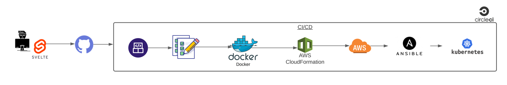
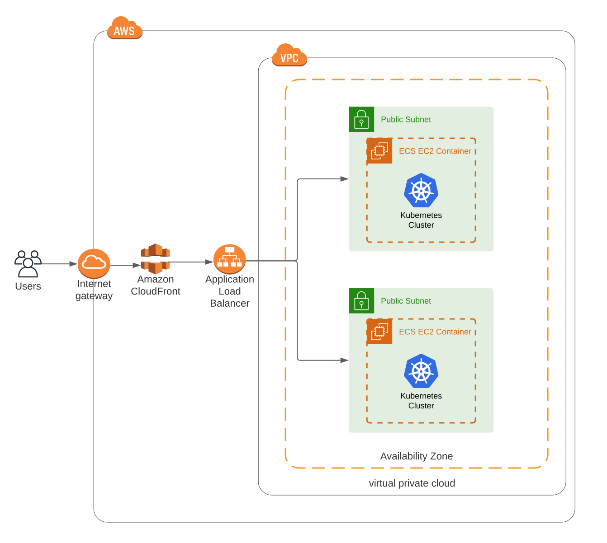
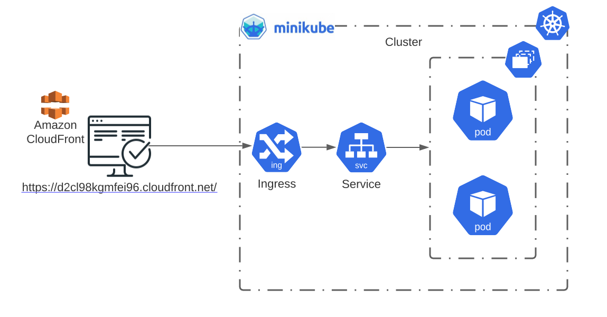

<div align="right">
<a href=https://circleci.com/gh/wils93/udacity_capstone_prj5/tree/master>

</a>
</div>

# Capstone Project 5 (*DGBWM*)

This is the final project for the [Udacity Cloud DevOps Engineer Nanodegree](https://www.udacity.com/course/cloud-dev-ops-nanodegree--nd9991).

In this project I applied the skills and knowledge that I gained throught the nanodegree program.

This includes:


* Also using [Svelte](https://svelte.dev/) to build up a simple static web app
* Using [CircleCI](https://circleci.com/) for CI/CD pipeline
* Using [CloudFormation](https://aws.amazon.com/cloudformation/) for automatic deployment of infrastructure
* Working in [AWS](https://aws.amazon.com/)
* Using [Docker](https://www.docker.com/) for building containerized  apps
* Using [NGINX](https://www.nginx.com/) for serving the website
* Using [Ansible](https://www.ansible.com/) for automatic configuration of infrastructure
* Using [Minikube](https://minikube.sigs.k8s.io/docs/) for building local Kubernetes clusters

## Project Overview

Did you ever get bored? Kept wondering around and surfing the internet for something interesting?
Kept searching for something with type & accessibility?

This simple project makes use of [Bored API](https://www.boredapi.com/) and built a static web app around it which
helps you to find a random task to do/learn whenever you are bored!

So you **D**on't **G**et **B**ored **W**ith **M**e (*DGBWM*)

## Project Workflow
* Developer updates the website code using Svelte
* Developer pushes code to GitHub
* CircleCI workflow starts:
    *  Lint
    *  Build
    *  Create Docker image and push to Docker Hub
    *  Use CloudFormation to create AWS infrastructure
    *  Use Ansible to configure infrastructure
    *  Use Ansible to start Kubernetes cluster
* Use AWS CloudFront to access the website

## Project Files
```
├── ansible                 # Ansible
│   ├── ansible.cfg             # global ansible configuration
│   ├── inventory.txt           # inventory for hosts to run on
│   ├── roles                   # Roles for ansible playbooks
│   │   ├── install-tools       # role to install needed tools
│   │   └── k8s-cluster         # role to enable/start minikube cluster
│   └── setup-server.yaml       # main ansible playbook
├── architecture            # Architecture Diagrams
│   ├── cloud.svg
│   ├── cluster.svg
│   └── workflow.svg
├── .c9                     # AWS Cloud9
│   └── resize.sh               # script to resize cloud9 instance
├── .circleci               # CircleCI
│   └── config.yml              # config file for CI/CD pipeline
├── cloudformation          # AWS CloudFormation
│   ├── cloudfront.yaml         # create cloudfront stack
│   ├── network-params.json     # params for network stack
│   ├── network.yaml            # create network stack
│   ├── servers-params.json     # params for servers stack
│   └── servers.yaml            # create servers stack
├── deploy.sh               # Deployment shell script
├── Dockerfile              # Dockerfile for build the image
├── k8s                     # Kubernetes
│   ├── deploy-cluster.yaml     # create deployment and needed services
│   └── ingress.yaml            # create nginx ingress
├── Makefile                # Makefile having targets to automate tasks
├── nginx                   # nginx server configuration
├── package.json
├── package-lock.json
├── README.md
├── run.sh                  # Script for create/update/delete CloudFormation stacks
└── src                     # Source code of website
```

## Project Architecture

#### Workflow


#### Cloud


#### Cluster


## Project Setup
In order to start working with the project you shall install the needed tools
Most of the steps are automated using the [`Makefile`](./Makefile)

To know all available targets use `$ make list`
```
$ make list
install-hadolint:
install-circleci:
install-k8s:
install-minikube:
install-docker:
install-ansible:
install-yq:
install-local:
build-local: install-local
run-local:
lint: install-local install-hadolint
build-image:
push-image: lint build-image
run-server: build-image
create-network:
delete-network:
create-servers:
delete-servers:
delete-stacks: delete-servers delete-network
run-cluster:
delete-cluster:
list:
```

Install needed tool
```
$ make install-* # where * to be replaced with the name of tool needed
```

### Run & debug locally

1. Build locally
```
$ make build-local
```

2. Install locally (for debugging)
```
$ make run-local
```

3. Visit website, go to
```
http://localhost:8080
```

### Run on Docker
1. Make sure that docker is installed
```
docker version
```

2. Build image locally
```
make build-image
```

3. Run docker container
```
make run-server
```

4. Test by visiting
```
http://localhost:80
```

### Run on Minikube (local K8S cluster)
1. Make sure Minikube is installed
```
minikube version
```

2. Run cluster locally
```
make run-cluster
```

3. Get cluster IP
```
minikube ip
```

4. Curl or visit browse
```
http://<minikube ip>:80
```

5. After finishing, clean up everything
```
make delete-cluster
```
